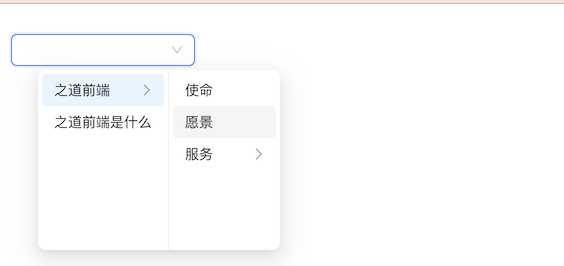

# `[P13-s1]` Cascader 级联选择组件-基础版

## 项目阶段简介

### 项目阶段介绍

按照设计稿和组件说明，实现基础版的 Cascader 级联选择组件。

基础版的 Cascader 级联选择组件主要实现基础功能，

重点是通过 [[P8] Dropdown下拉菜单组件](https://github.com/ZhiDaoFE/P8-dropdown-component) 来实现功能，能够正确生成菜单，并展示即可。

### 组件说明

- 使用 Dropdown下拉菜单组件实现 Cascader 级联选择组件
- 可以通过配置生成级联选择菜单
- 支持取消选择功能

### 设计稿说明

- 页面中就只有一个级联选择框，它的具体交互是：
  - 当鼠标 `hover` 到级联选择框时：
    - 它的边框会变蓝；
    - 如果级联选择框已经有选择好的内容的话，右边会出现清除内容的小图标，点击清除按钮之后，级联选择框选择过的内容将会被删除。

  - 当鼠标点击级联选择框时：
    - 它会有选中态：边框变蓝，出现阴影；
    - 弹出级联选择菜单，这个菜单的交互是：
      - 当菜单项存在子菜单时，菜单项右边会展示一个右箭头表示该菜单项拥有子菜单项；
      - 点击某个菜单项时：
        - 如果该菜单项有子菜单，那在该菜单项的右侧显示子菜单选项列表；
        - 如果该菜单项没有子菜单，则关闭菜单，并设置级联选择框组件的 `value` 值为按顺序的菜单项路径的菜单` value` 值数组，同时调用 `onChange` 回调，回调的参数即为级联选择框组件的 `value` 值。

    - 如果级联选择框组件已经有 `value` 值，弹出的级联选择菜单应该要展示已经选中的菜单项。

  - 当已经弹出级联选择菜单时，鼠标点击级联选择菜单之外的任意地方时，收起级联选择菜单，同时级联选择菜单的显示状态要恢复到刚弹出级联选择菜单时的显示状态。

> [在线体验](https://zhidaofe.github.io/P13-cascader-component/s1/index.html)

### 项目要求

- 先按照设计稿和组件说明，实现组件代码。然后在页面中使用你实现的组件来达到题目要求
- 保证最终实现的页面完全复现设计稿，真实的工作中，火眼金睛的设计师 1 px 的差异都能找到，不要心存侥幸
- **先按照设计稿和组件说明真得去开发，不要看参考答案！**，也不要去看业界和开源的组件库代码
- 如果开发过程中碰到问题，不知道怎么实现的话，去网上查找答案，不要去看答案！在真实的工作中，你不会有参考答案的，你只能自己想办法找到问题的解决方案
- 记录你的疑问，比如：
  - 有个很难实现的地方，总感觉自己实现的方案不是最优方案，还有更好的方案
  - 不知道自己的实现方案到底好不好
  - 完成开发之后，再整体 review 一遍自己的代码，觉得还有哪些地方是不够好的
- 带着你的疑问，再去查看参考答案或者开源组件库去寻找答案，如果还是没有得到解答，请来 [**之道前端**](https://kcnrozgf41zs.feishu.cn/wiki/PBj0w5rjUiEWVgktZE0caKOunNc) 提问

### 练习本项目你会收获什么？

- 提升原生 JavaScript 的编码熟练度
- 学会正确使用原生 JavaScript 处理 Dom
- 学会正确使用原生 JavaScript 处理 DOM 事件
- 学会正确使用原生 JavaScript 更新 Dom 结构
- 学会如何封装一个组件
- 【进阶】深刻理解什么是好的组件
- 【进阶】感受原生 JavaScript 更新 Dom 结构的问题
- 【进阶】积累封装组件的经验
- 【进阶】逐渐形成自己的 JavaScript 代码风格

> 如果只实践一次，那就只会有基础收获
>
> 只有不断练习、思考、优化，才会有进阶收获

### 本项目适合的同学

- 处于 L2 水平的同学
- 对原生 JavaScript 还不熟练的同学
- 没怎么封装过 UI 组件的同学
- 没怎么写过 C 端页面，大部分时间在做 admin 系统的同学
- 只会开发 React/Vue 组件，想要练习如何封装原生 JavaScript 组件的同学

## 开始练习

我们针对不同经验的同学提供了相应的[练习指引手册](https://kcnrozgf41zs.feishu.cn/wiki/An7GwvUQrirdvdkJdQ9c4q3Rndd)，你可以按照这个指引手册来练习本项目。

