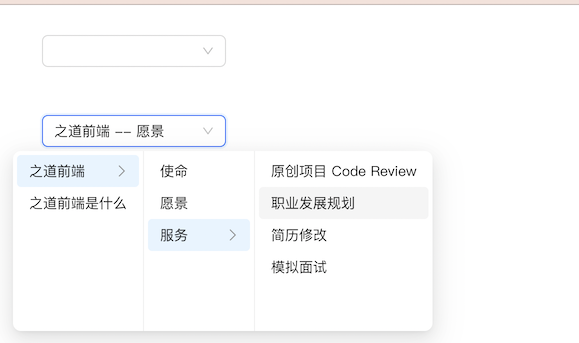

# `[P13-s2]` Cascader 级联选择组件-增强版

## 项目阶段简介

### 项目阶段介绍

按照设计稿和组件说明，扩展基础版 Cascader 级联选择组件，实现增强版的 Cascader 级联选择组件。

基础版 Cascader 级联选择组件已经实现了核心的基础功能，

增强版的 Cascader 级联选择组件将会在展示文案、菜单触发逻辑等方面扩展。

### 组件说明

- 支持自定义展示文案
- 级联选择菜单支持 hover 展开下一级菜单

### 设计稿说明

- 上面的级联选择框跟 s1 的一样，因为 s2 是在 s1 的基础上扩展而来的。
- 下面的级联选择框的菜单配置跟 s1 的一样。
- 下面的级联选择框在展示选中内容时，用 " -- " 分隔选项 `label`。
- 点击下面的级联选择框，会弹出级联菜单，这个菜单展开子菜单的模式是 `hover` 模式，它跟 s1 的级联菜单的交互差异是：
  - 当鼠标移入某个菜单项时：
    - 如果该菜单项有子菜单，则选中该菜单项（底色变蓝），并在该菜单项的右侧显示子菜单选项列表；
    - 如果该菜单项没有子菜单，则不做任何处理。
  - 点击某个菜单项时：
    - 如果该菜单项有子菜单，则不做任何处理。
    - 如果该菜单项没有子菜单，则关闭菜单，并设置级联选择框组件的 `value` 值为按顺序的菜单项路径的菜单` value` 值数组，同时调用 `onChange` 回调，回调的参数即为级联选择框组件的 `value` 值。
  

> [在线体验](https://zhidaofe.github.io/P13-cascader-component/s2/index.html)

### 项目要求

- 增强版是要在基础版的 Cascader 级联选择组件上进行扩展的，因此把你的 s1 答案 copy 过来之后，再进行 s2 的练习
- 先按照设计稿和组件说明，实现组件代码。然后在页面中使用你实现的组件来达到题目要求
- **先按照设计稿和组件说明真得去开发，不要看参考答案！**，也不要去看业界和开源的组件库代码
- 如果开发过程中碰到问题，不知道怎么实现的话，去网上查找答案，不要去看答案！在真实的工作中，你不会有参考答案的，你只能自己想办法找到问题的解决方案
- 记录你的疑问，比如：
  - 有个很难实现的地方，总感觉自己实现的方案不是最优方案，还有更好的方案
  - 不知道自己的实现方案到底好不好
  - 完成开发之后，再整体 review 一遍自己的代码，觉得还有哪些地方是不够好的
- 带着你的疑问，再去查看参考答案或者开源组件库去寻找答案，如果还是没有得到解答，请来 [**之道前端**](https://kcnrozgf41zs.feishu.cn/wiki/PBj0w5rjUiEWVgktZE0caKOunNc) 提问

### 练习本项目你会收获什么？

- 提升原生 JavaScript 的编码熟练度
- 学会正确使用原生 JavaScript 实现 hover 效果
- 学会如何封装一个组件
- 练习如何设计组件的对方方法
- 【进阶】深刻理解什么是好的组件
- 【进阶】积累封装组件的经验
- 【进阶】深刻理解如何控制一个被封装的组件，以及组件之间的联动是怎样的
- 【进阶】逐渐形成自己的 JavaScript 代码风格

> 如果只实践一次，那就只会有基础收获
>
> 只有不断练习、思考、优化，才会有进阶收获

### 本项目适合的同学

- 处于 L2 水平的同学
- 对原生 JavaScript 还不熟练的同学
- 没怎么封装过 UI 组件的同学
- 没怎么写过 C 端页面，大部分时间在做 admin 系统的同学
- 只会开发 React/Vue 组件，想要练习如何封装原生 JavaScript 组件的同学

## 开始练习

我们针对不同经验的同学提供了相应的[练习指引手册](https://kcnrozgf41zs.feishu.cn/wiki/An7GwvUQrirdvdkJdQ9c4q3Rndd)，你可以按照这个指引手册来练习本项目。

